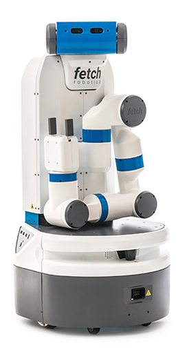
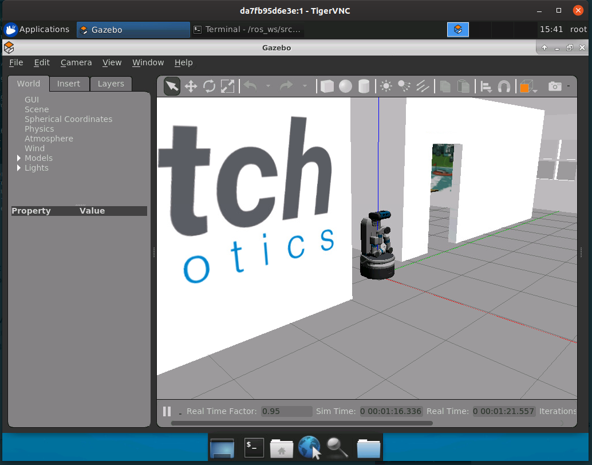

Fetch
=====

Usage
-----

To launch the Fetch robot in a simulated office:

.. code:: command

   $ roslaunch fetch_gazebo pickplace_playground.launch

Once the robot has been spawned in the simulated world, a demo application can
be started by executing the following:

.. code:: command

   $ roslaunch fetch_gazebo_demo pick_place_demo.launch

Note: This execution may not terminate.

Headless Execution
..................

To ensure that the camera works correctly during headless execution, we must
use Xvfb to create a virtual X server, as shown below. Failing to do so will
lead to a camera that silently does nothing.

.. code:: command

   $ Xvfb :1 -screen 0 1600x1200x16  &
   $ export DISPLAY=:1.0

References
----------

* https://answers.gazebosim.org//question/14625/running-a-camera-sensor-headless
