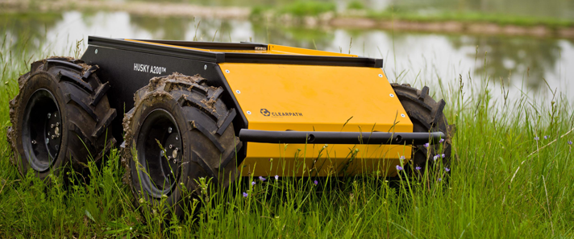

Husky
=====

Usage
-----

To launch the Husky robot in a simulated driving obstacle course:

.. code:: command

   $ roslaunch husky_gazebo husky_playpen.launch

To launch the navigation stack with ACML (note that AMCL provides the transform from the map frame to the odometry frame, which is a function needed to get move base to work in the map frame. ACML works with a known map, while SLAM fills a similar function when a map is unknown):

.. code:: command

   $ roslaunch husky_navigation amcl_demo.launch

To send a simple goal (where goal_file.yml is replaced with the name of a file containing a yaml representation of a geometry_msgs/PoseStamped in the map frame):

.. code:: command

   $ rostopic pub -f goal_file.yml /move_base_simple/goal geometry_msgs/PoseStamped

References
----------

* https://index.ros.org/p/husky_simulator/github-husky-husky/#melodic
* https://github.com/husky
